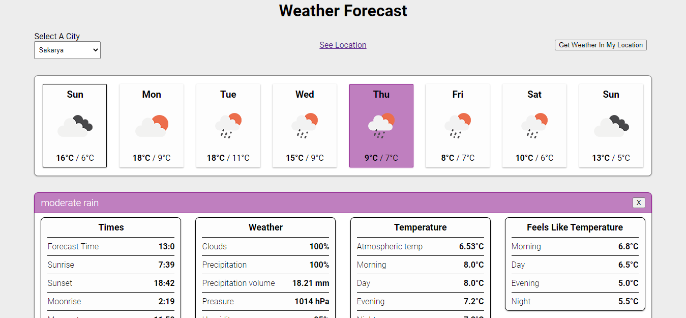

# React Weather App
## 1 week weather forecast for cities in Turkey
### Uygulama üzerinden Türkiye'deki şehirlerimize ait 1 haftalık hava durumu tahminlerini ve detaylarını görebilmekteyiz. Dilerseniz konumunuzu 'Get Weather In My Location' butonuyla otomatik getirebilirsiniz.
### Veriler OpenWeatherMap Api üzerinden gelmektedir. Detaylı bilgi için [buraya](https://openweathermap.org) tıklayınız.
#### `npm install` ile önce gerekli paketleri indirmelisiniz. Sonra `npm start` ile uygulamayı başlatabilisiniz. http://localhost:3000/ adresinde çalışacaktır.

## Uygulama Görünümü

- Sol üstteki dropdowndan şehri seçtiğimizde hava durumu tahminleri geliyor olacaktır
- Dropdownda seçtiğimiz şehrin tam lokasyonunu dilersek 'See Location' linki ile Google Maps üzerinden görebiliriz.
- 'Get Weather In My Location' butonuyla tarayıcı, konumunuzu algılayıp hava durumu tahminlerini getircektir. *Bunun için tarayıcı üzerinden konum erişimine izin vermeniz gerekmektedir.*
- İçinde olduğumuz gün siyah kenarlıkla işaretlenmiştir.
- Hava durumuna ait detayları görüntülemek için ilgili karta tıklamamız yeterlidir.

### Kullanılan Teknolojiler
- React JS
- React Hooks
- Global State yönetimi için Context Api
- OpenWeatherMap Api
